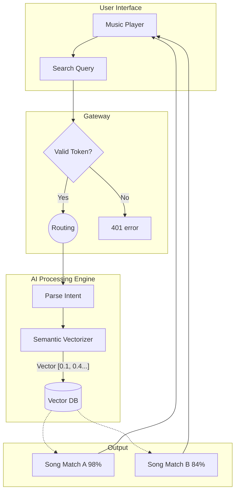

## THE HYPOTHESIS
What if we could use AI to relate songs to each other?

todays music streaming services are good, but not great at relating songs to each other. this is because they are based on human curation and algorithms that are not always accurate. This engine attempts to solve this problem by using AI to vectorize music and then compare songs to each other to find songs that are similar to each other.

## TECHNICAL ANALYSIS
vectorized music for better song suggestions. by using AI to vectorize music and then use vector search to find songs that are similar to each other. 

> This is a work in progress and is not yet ready for production use.

## FINAL RESULT

"Initial concepts are promising. Algorithmic patterns can reduce writer's block significantly."
