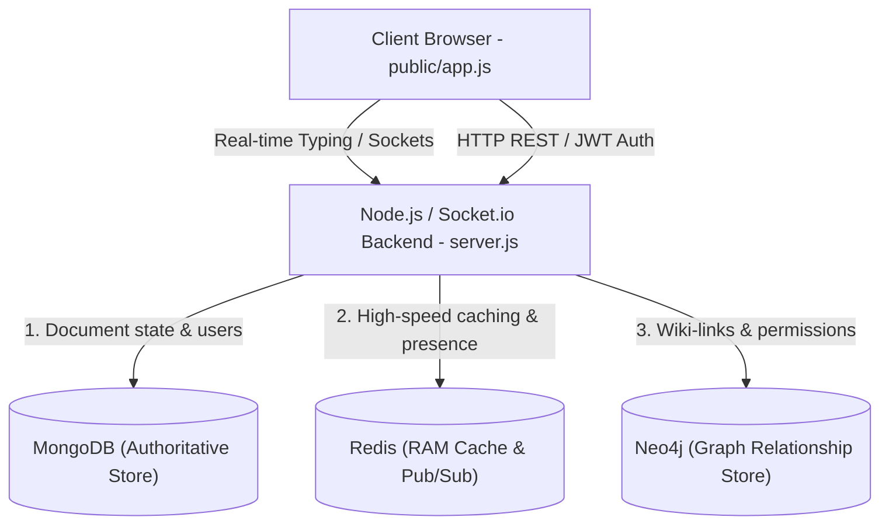
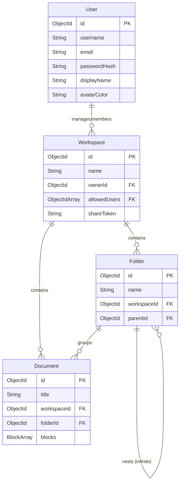
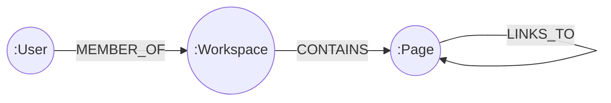
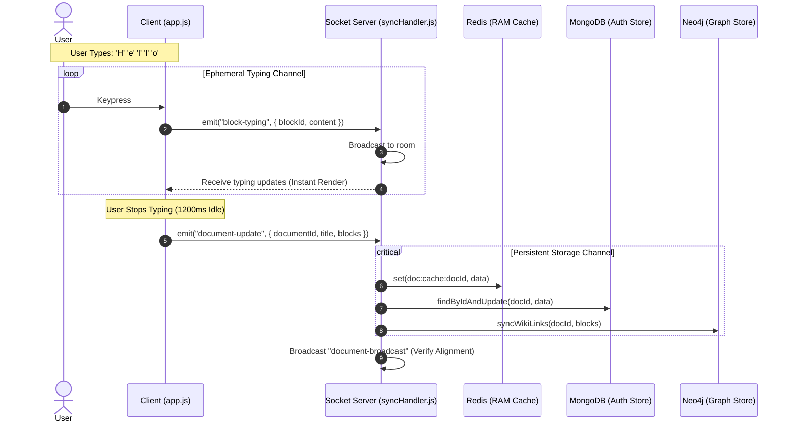

# BlockSync: A Polyglot Persistence Engine for Real-Time Collaborative Document Editing

**Course:** Databases II (Mandatory Course Project)  
**Institution:** Faculty of Computer Science and Engineering  
**Academic Year:** 2025/2026  

**Mentors:** Dijana and Petar  
**Group Members:**  
* **Tomche Dukoski - 1368**  

---

## Executive Summary

**BlockSync** is a block-based collaborative writing environment (similar to Notion) utilizing a hybrid **Polyglot Persistence Architecture**. Rather than forcing all application state into a single relational or non-relational database, BlockSync distributes data across three specialized NoSQL database systems to optimize performance, real-time collaboration, document link tracing, and structural permissions:

1. **MongoDB**: Serves as the primary, authoritative storage for user credentials, document contents (composed of ordered, rich block arrays), workspace boundaries, and folder structures.
2. **Neo4j**: Maps workspace graph relationships, tracking user permission boundaries, page containment, and bidirectional wiki-style wiki-links (`[[Wiki-Link]]`) between pages for real-time backlink parsing and graph visualization.
3. **Redis**: Operates as a volatile caching engine, user presence registry, and Socket.io cluster pub/sub mechanism to back the real-time editing pipelines.

Additionally, this project implements a custom **Twin-Channel Real-Time Character Synchronization** protocol designed to isolate heavy disk writes from instant browser communication, prioritizing a responsive user experience.

---

## 1. Introduction & Objectives

In modern collaborative platforms, content synchronization must occur in near-zero latency, yet document structures contain complex relational dependencies. Standard databases fall short when tasked with simultaneously addressing:
* **Rich Document Hierarchies**: Deeply nested blocks (paragraphs, checklists, headers) that are frequently rearranged.
* **Graph-structured Data**: Cross-document referencing, backlink lookups (discovering which documents point to the current page), and dynamic access control trees.
* **High-frequency Concurrent Updates**: Multiple writers modifying the same character sequence, which causes immense write loads if synced to persistent storage on every keypress.

### Objectives of BlockSync:
* **Polyglot Optimization**: Utilize MongoDB for document state, Neo4j for semantic and permission graphs, and Redis for high-speed ephemeral presence and messaging.
* **Wiki-style Cross-linking**: Support bidirectional page linking using the `[[Page Title]]` syntax, automatically resolved and tracked in the graph database.
* **Visual Graph Exploration**: Render the workspace as an interactive visual graph showing pages and user memberships.
* **Performant Real-time Syncing**: Implement a twin-channel sync strategy that provides sub-millisecond typing reflections while preventing database lockups.

---

## 2. Polyglot Database Description & Schema Architecture

BlockSync relies on a hybrid database architecture. The system runs on Docker Compose, isolating services for MongoDB, Redis, and Neo4j.



### 2.1. MongoDB (Authoritative Document Store)
MongoDB stores the definitive state of the application. Due to its flexible document schema, it is highly suited for storing hierarchical documents with nested block configurations.

#### Schemas Defined (`backend/models/Schemas.js`):
* **User**: Stores unique usernames, email credentials, hashed passwords, and visual profile settings.
* **Workspace**: Acts as a collaborative partition owned by a user, containing access control lists (`allowedUsers`).
* **Folder**: Represents a directory with support for infinite nested child folders using self-referencing `parentId` pointers.
* **Document**: Contains metadata and an ordered array of blocks.
* **Block**: Embedded documents inside the Document schema, representing modular items like paragraph texts, checklists, and headings.



### 2.2. Neo4j (Graph Database)
Neo4j maps structural containment and logical references. In a traditional relational system, parsing connections and calculating backlinks requires expensive SQL joins. In MongoDB, indexing cross-document references requires parsing nested arrays. Neo4j resolves this by treating pages, users, and workspaces as nodes connected by lightweight edges.

#### Graph Nodes & Relationships:
* `(u:User {id: $userId})`
* `(w:Workspace {id: $workspaceId})`
* `(p:Page {id: $pageId, title: $title})`

#### Relationship Types:
* `(:User)-[:MEMBER_OF]->(:Workspace)`: Access control permissions.
* `(:Workspace)-[:CONTAINS]->(:Page)`: Workspace containment.
* `(:Page)-[:LINKS_TO]->(:Page)`: Wiki-links generated by page links (`[[Target Title]]`).



### 2.3. Redis (Volatile Cache & Pub/Sub)
Redis provides sub-millisecond read speeds and acts as a central event bus.
* **Presence Registries**: Tracks online statuses inside active rooms under `presence:{documentId}:{socketId}` keys, expiring after 1 hour.
* **Performance Caching**: Caches documents as stringified JSON strings at `doc:cache:{documentId}` with a 10-minute expiration time (`EX 600`), bypassing MongoDB disk reads when fetching active documents.
* **Pub/Sub Channel**: Uses `doc-events` to coordinate updates across multiple backend instances when scaling horizontally.

---

## 3. Technical Implementation Details

### 3.1. Document Schema (MongoDB / Mongoose)
The document content is structured as an ordered sub-document array. This allows clients to rearrange, insert, or delete block nodes without rewriting the entire document object.

```javascript
// From backend/models/Schemas.js
const BlockSchema = new Schema({
  id: { type: String, required: true },
  type: {
    type: String,
    enum: ['heading_1', 'heading_2', 'paragraph', 'bulleted_list', 'checklist'],
    default: 'paragraph'
  },
  content: { type: String, default: '' },
  checked: { type: Boolean, default: false }
}, { _id: false });

const DocumentSchema = new Schema({
  title: { type: String, required: true, default: 'Untitled Page' },
  workspaceId: { type: Schema.Types.ObjectId, ref: 'Workspace', required: true },
  folderId: { type: Schema.Types.ObjectId, ref: 'Folder', default: null },
  blocks: { type: [BlockSchema], default: [] }
}, { timestamps: true });
```

### 3.2. Wiki-Link Parsing & Bidirectional Backlink Resolution (Neo4j)
When a user types a wiki-link like `[[Meeting Notes]]` inside a text block, the backend extracts the title, finds or creates the corresponding page node in Neo4j, and adds a `LINKS_TO` relationship.

The query matches case-insensitively. If the page doesn't exist, a placeholder node is generated using a UUID generator.

```javascript
// From backend/services/graphService.js
async syncWikiLinks(fromPageId, blocks) {
  const session = driver.session();
  try {
    const linkPattern = /\[\[(.*?)\]\]/g;
    const targetTitles = new Set();

    blocks.forEach(block => {
      if (block.content) {
        let match;
        while ((match = linkPattern.exec(block.content)) !== null) {
          targetTitles.add(match[1].trim());
        }
      }
    });
    const targets = Array.from(targetTitles);

    // 1. Delete previous outgoing links to establish a clean slate
    await session.executeWrite(tx =>
      tx.run(
        'MATCH (from:Page {id: $fromPageId})-[r:LINKS_TO]->(:Page) DELETE r',
        { fromPageId: fromPageId.toString() }
      )
    );

    if (targets.length === 0) return;

    // 2. Merge target pages and link them
    await session.executeWrite(tx =>
      tx.run(
        `MATCH (from:Page {id: $fromPageId})
         UNWIND $targets AS targetTitle
         MERGE (to:Page {title: targetTitle})
         ON CREATE SET to.id = randomUUID()
         MERGE (from)-[:LINKS_TO]->(to)`,
        { fromPageId: fromPageId.toString(), targets }
      )
    );
  } finally {
    await session.close();
  }
}
```

To fetch backlinks, a single graph traversal returns all pages pointing to the current document ID:

```javascript
async getBacklinks(pageId) {
  const session = driver.session();
  try {
    const result = await session.executeRead(tx =>
      tx.run(
        `MATCH (origin:Page)-[:LINKS_TO]->(target:Page {id: $pageId})
         RETURN origin.id AS id, origin.title AS title`,
        { pageId: pageId.toString() }
      )
    );
    return result.records.map(record => ({
      id: record.get('id'),
      title: record.get('title')
    }));
  } finally {
    await session.close();
  }
}
```

### 3.3. Graph Reconciliation Algorithm (MongoDB ⇄ Neo4j)
To prevent structural divergence (e.g., when a document is renamed or deleted, or if a database query fails), the system runs a reconciliation check before serving the visual graph to clients. 

```javascript
// From backend/services/graphService.js
async syncWorkspaceFromMongo(workspaceId, mongoDocs) {
  const session = driver.session();
  try {
    const mongoIds = mongoDocs.map(d => d.id.toString());

    // 1. Rebuild current pages and link them to the workspace node
    if (mongoDocs.length > 0) {
      await session.executeWrite(tx =>
        tx.run(
          `MERGE (w:Workspace {id: $workspaceId})
           WITH w
           UNWIND $pages AS page
           MERGE (p:Page {id: page.id})
           SET p.title = page.title
           MERGE (w)-[:CONTAINS]->(p)`,
          {
            workspaceId: workspaceId.toString(),
            pages: mongoDocs.map(d => ({ id: d.id, title: d.title }))
          }
        )
      );
    }

    // 2. Delete nodes in Neo4j that are no longer in MongoDB
    await session.executeWrite(tx =>
      tx.run(
        `MATCH (w:Workspace {id: $workspaceId})-[:CONTAINS]->(p:Page)
         WHERE NOT p.id IN $mongoIds
         DETACH DELETE p`,
        { workspaceId: workspaceId.toString(), mongoIds }
      )
    );
  } finally {
    await session.close();
  }
}
```

---

## 4. Twin-Channel Real-Time Character Synchronization

BlockSync splits data transmission into two distinct pipelines (channels) when a user edits content:



### Channel 1: Ephemeral Over-RAM Channel
* **Event**: `block-typing` (Client ⇄ Socket.io server).
* **Behavior**: Pushes raw HTML character changes immediately on every keystroke.
* **Storage Impact**: No database operations (MongoDB, Neo4j, or Redis) are triggered. Sockets broadcast the change directly to other connected clients in the room.

### Channel 2: Debounced Persistent Storage Channel
* **Event**: `document-update`.
* **Behavior**: Runs a 1200ms debounce timer in the client's browser. If the user stops typing for 1200ms, the client serializes the full document structure and emits the update.
* **Storage Impact**: Writes the state to MongoDB, rebuilds references in Neo4j, and refreshes the Redis document cache.

### Technical Analysis: Trade-off of Data Integrity vs. User Experience

| Evaluation Parameter | Ephemeral RAM Channel | Debounced Persistent Channel |
| :--- | :--- | :--- |
| **Write Target** | Client volatile memory | MongoDB, Neo4j, and Redis caches |
| **Trigger Interval** | Instantaneous per keystroke | 1200ms idle timer (debounced) |
| **Network Overhead** | Tiny payloads, high packet frequency | Full structural JSON arrays |

#### 1. Impact on Data Integrity (Temporary Reduction)
* **Risk of Edits Loss**: Edits made during the 1200ms typing window reside in volatile memory. If a client crashes or loses power before the debounce timer fires, the unsaved characters are lost.
* **Lack of OT/CRDT Conflict Resolution**: Without Operational Transformations (OT) or Conflict-free Replicated Data Types (CRDTs), concurrent inputs on the same block may cause race conditions where a database write overwrites other keystrokes.

#### 2. Impact on User Experience (Significant Improvement)
* **Zero UI Lag**: Bypassing database writes on every keystroke reduces network congestion and thread blocking.
* **Reduced Database Wear**: Debouncing inputs saves database wear (saving write IOPS). In a multi-user environment, thousands of keypresses are consolidated into a single database update.
* **Live Co-Presence Feeling**: Near-instant updates create a fluid, responsive collaborative workspace.

---

## 5. Visual Workspace Graph View

Using Neo4j's graph layout, the workspace renders its internal page links dynamically. The workspace graph endpoint fetches the node layout and formats it for frontend visualization:

```javascript
// From backend/services/graphService.js
async getWorkspaceGraph(workspaceId) {
  const session = driver.session();
  try {
    const result = await session.executeRead(tx =>
      tx.run(
        `MATCH (w:Workspace {id: $workspaceId})-[:CONTAINS]->(p:Page)
         OPTIONAL MATCH (p)-[:LINKS_TO]->(target:Page)
         RETURN p.id AS id, p.title AS title, collect(target.id) AS linkedToIds`,
        { workspaceId: workspaceId.toString() }
      )
    );

    const nodes = [];
    const links = [];

    result.records.forEach(record => {
      const id = record.get('id');
      nodes.push({ id, title: record.get('title') || 'Untitled' });

      const targets = record.get('linkedToIds');
      targets.forEach(targetId => {
        if (targetId) {
          links.push({ source: id, target: targetId });
        }
      });
    });

    return { nodes, links };
  } finally {
    await session.close();
  }
}
```

---

## 6. How to Run & Verify the Project

### Prerequisites
* Docker & Docker Compose
* Node.js (version 18+ recommended)

### Step 1: Clone and Run Services
Run the database services using Docker:
```bash
docker-compose up -d
```
Verify the services are running:
* **MongoDB**: `localhost:27017`
* **Redis**: `localhost:6379`
* **Neo4j**: `localhost:7474` (Bolt: `localhost:7687`)

### Step 2: Configure Environment Variables
Create a file named `.env` in the `backend` directory:
```env
PORT=5000
HOST=127.0.0.1
MONGO_URI=mongodb://127.0.0.1:27017/blocksync
REDIS_URL=redis://127.0.0.1:6379
NEO4J_URI=bolt://127.0.0.1:7687
NEO4J_USER=neo4j
NEO4J_PASSWORD=password
JWT_SECRET=super_secure_course_token_2026
```

### Step 3: Run the Backend Server
Navigate to the `backend` directory and install dependencies:
```bash
cd backend
npm install
npm run dev
```

### Step 4: Run the CLI Graph Sync Tool
To run the sync tool and reconcile the graph database manually:
```bash
node sync-graph.js
```

---

## 7. Conclusion & References

By splitting data storage across MongoDB, Neo4j, and Redis, BlockSync builds a highly responsive collaborative environment that handles structural document relationships without impacting database performance. The twin-channel synchronization model balances immediate visual updates with stable disk writes, illustrating a practical compromise between data consistency and real-time responsiveness.

### References:
1. *MongoDB Schema Design Best Practices*, MongoDB Press.
2. *Neo4j Cypher Query Language Reference Guide*, Neo4j Manual.
3. *Redis Pub/Sub & Caching Patterns*, Redis Labs.
4. *Socket.io Real-time Transport Protocol Specification*, Socket.io Foundation.
5. *Databases II Course Lectures*, Faculty of Computer Science and Engineering.
